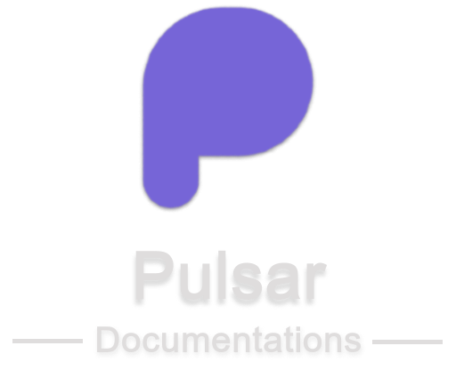
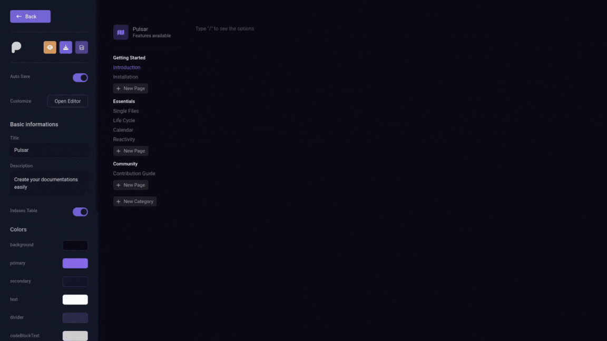

<div align="center">
  
  <div>
    
    
    
    
    
  </div>
  <div>
    <br />
    <p>Pulsar is a powerfull <strong>documentation online editor</strong></p>
    <p>Pulsar is the ultimate solution for streamlining documentation page creation. With its intuitive interface and powerful features, Pulsar allows you to quickly and efficiently build documentation pages. Organize information, add content effortlessly, and deliver a seamless documentation experience for your users.</p>
  </div>

  [Getting started](#getting-started) •
  [Cloning Repository](#cloning-repository) •
  [Contribute](#contribute)
  
</div>

<div>
  <hr />
  
  <hr />
  <h2>Getting Started</h2>
  <p>Getting Started with Pulsar, your gateway to efficient online documentation editing. If you're ready to embark on a journey of creating impeccable documentation pages, you've come to the right place. You can access the project on this url</p>
  <a href="https://pulsar.diogopereira.tech">https://pulsar.diogopereira.tech</a>
  <br />
  <br />
  <br />
  <h2>Project To-do-List</h2>

  - [x] Create the feature to the user host documentations on Pulsar - branch: v2.0.0
  - [ ] Implement TDD to API routes
  - [ ] Create Pulsar own markdown editor and remove Tiptap
  - [ ] Add notes blocks to the editor
  - [ ] Upgrade the usability and customization of tables on editor
  - [ ] Remove some PrimeVue things like inputs and buttons, because is lagging on mobile devices
  - [ ] Upgrade the editor page interface
  - [ ] Upgrade the customizations page interface
  - [ ] Add the feature flag to search for pages on navigation menu of pages preview/doc
  - [ ] Create a templates area on editor page, to agilize the documentation creation process
  - [ ] Integrate the editor with an AI
  <br />
  <h2>Cloning Repository</h2>
  <p>To run the project on your machine and contribute to the project, you can clone the repository and run the following commands:</p>

  ```
  git clone https://github.com/FhillSlinger/pulsar.git
  ```

  <p>Move to the folder:</p>

  ```
  cd pulsar
  ```

  <p>Install the dependencies using <strong>>pnpm</strong>:</p>

  ```
  pnpm install
  ```

  <p>And finally run the project in development mode:</p>

  ```
  pnpm dev
  ```

  <p>After execute the command pnpm dev, you can access the project in http://localhost:3000</p>
  <br />
  <h2>Contribute</h2>
  <p>Please star the project and help the developer with a donation on Buy me a Coffe:</p>
  <br />
  <a href="https://www.buymeacoffee.com/diogopereiy" target="_blank">
    
  </a>
</div>
